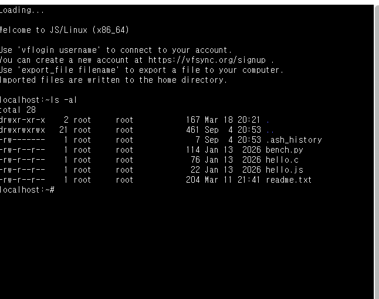
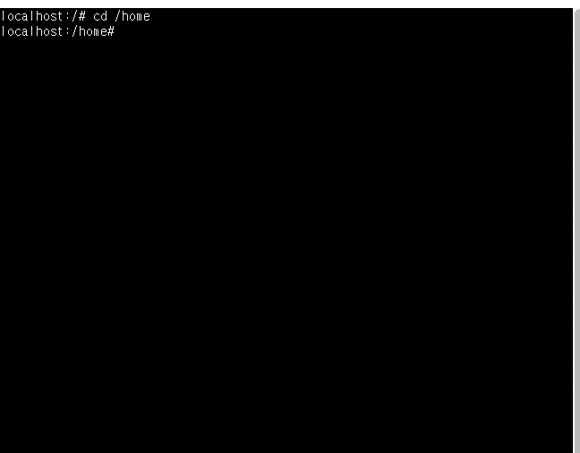
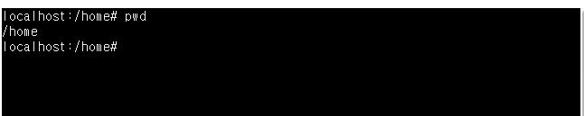
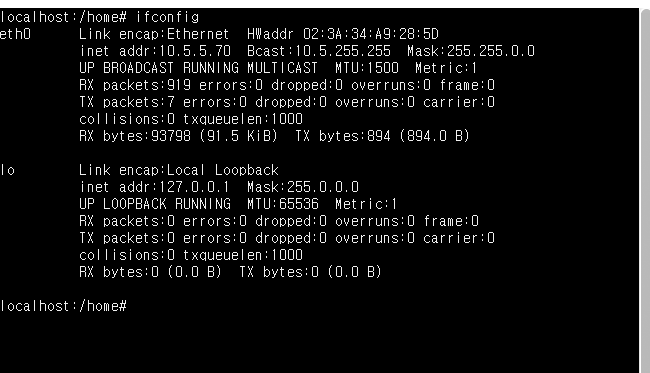

# 가상머신이란 무엇인가?
- 가상머신은 가상화 소프트웨어를 이용하여 소프트웨어적으로 구현한 컴퓨터를 말함.
- 하나의 물리적 하드웨어 위에 가상화 소프트웨어가 CPU, 메모리, 디스크 등의 자원을 논리적으로 분할/할당 하여 마치 독립된 컴퓨터가 여러 대 존재하는 것처럼 동작하게 함.

# 가상머신을 사용하는 이유를 설명하라.
- 하나의 컴퓨터에서 여러 운영체제를 동시에 사용 가능
- 안전한 실험환경 제공
- 하드웨어 자원의 효율적 활용
- 이식성과 백업 용이성
- 멀티부팅의 위험 회피 등이 있음.

# WSL2가 다른 가상머신 소프트웨어와 비교하여 장점이 무엇인가?
| 장점 | 설명 |
| --- | --- |
| 높은 Linux 호환성 | 실제 Linux 커널을 탑재하여 Docker 실행, 대규모 컴파일 등 기존 WSL1에서 불가했던 기능들이 정상 작동. |
| 뛰어난 속도 | Windows 파일 시스템과의 연동 속도가 크게 향상되어 파일 읽기/쓰기 작업이 빠름. |
| 낮은 자원 소모 | 다른 가상화 소프트웨어는 사용자 지정한 만큼의 메모리/CPU를 점유하지만, WSL2는 필요한 만큼만 사용. |
| IDE와의 연동 | VS CODE와 같은 Windows에 설치된 개발 도구로 Linux 내부의 코드를 직접 수정/디버깅 가능. |
| 경량 구조 | 별도의 무거운 가상 데스크톱 환경을 구동하지 않는 경량 유틸리티 가상 머신 구조로 되어있어 부팅과 실행이 빠름. | 

# GUI, CLI의 장단점을 비교 설명하시오.
| 구분 | GUI | CLI |
| --- | --- | --- |
| 정의 | 그래픽을 통해 사용자와 컴퓨터가 소통하는 방식 | 명령어를 통해 사용자와 컴퓨터가 소통하는 방식 |
| 장점 | 직관적이고 배우기 쉬우며 마우스 클릭만으로 조작이 가능하여 초보자에게 유리하고 시각적으로 결과를 바로 확인 가능 | 처리 속도가 빠르고 시스템 자원 소모가 적으며 반복 작업의 자동화에 용이 | 
| 단점 | 상대적으로 시스템 자원을 많이 사용하고, 네트워크 통신량이 많아 원격 환경에서 불리하며 세밀한 제어나 자동화가 어려움 | 명령어를 많이 외워야해서 초보자에게 어려우며 결과가 텍스트로만 표시 |
| 주 사용처 | 개인용 데스크톱, 일반 응용 프로그램 | 서버 관리, 개발 환경, 원격 시스템 제어 |
# CLI방식의 인터페이스가 GUI방식보다 처리속도가 빠른 이유를 설명하라.
- GUI는 아이콘, 창, 버튼 등의 그래픽 요소를 화면에 그리고 렌더링을 해야해서 CPU와 메모리 자원을 많이 소모하기 때문에 네트워크를 통한 원격 제어 시에는 통신해야 할 데이터 양이 매우 큼.
- CLI는 키보드로 입력한 명령어와 결과 텍스트만 교환하면 되므로 처리해야할 데이터 양이 훨씬 적어 원격 통신에 유리.

# 리눅스에서는 왜 CLI방식을 주로 사용하는가?
- 리눅스는 주로 서버 컴퓨터의 운영체제로 사용되고, 서버는 대부분 데이터 센터에 위치해있어 네트워크를 통해 원격 접속하여 작업을 처리해야 함.
- 이 때에, GUI 방식을 사용하면 화면 정보 전송으로 인한 통신 데이터량이 많아져 속도가 느려지는 문제 발생.
- 리눅스는 CLI 방식으로 통신 데이터량이 적은 텍스트 기반으로 원격 환경에서도 빠른 처리 속도를 확보 가능.

# 리눅스 명령어란 무엇이고 중요 5개 명령어를 조사하라. 실행결과를 첨부하라.
| 명령어 | 기능 | 사용 예시 |
| --- | --- | --- |
| 'ls' | 현재 디렉터리의 파일 및 폴더 목록 출력 |  |
| 'cd' | 작업 위치 이동 |  |
| 'pwd' | 현재 작업 중인 디렉터리 경로 출력 |  |
| 'ifconfig' | 네트워크 인터페이스의 ip 주소 등 네트워크 정보 확인 |  |
| 'mkdir' | 새 디렉터리(폴더) 생성 |  |
