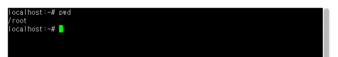
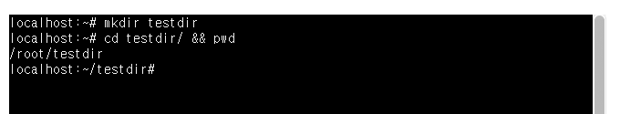
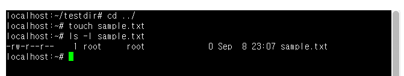
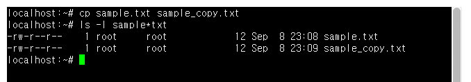
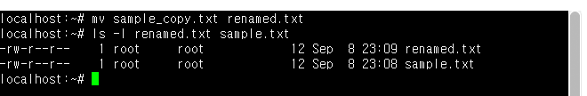
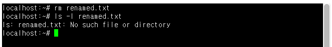
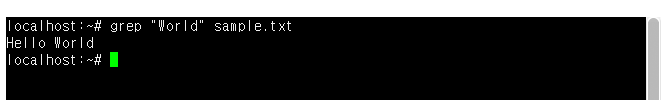
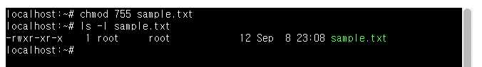

# 리눅스 명령어가 무엇인지 설명하시오. 또, 실제 명령어의 정체는 무엇인가?
* 명령어란, 운영체제(셸)에게 특정 작업을 수행하도록 지시하는 단어.
* 사용자가 프롬프트에 명령어를 입력하면, 셸이 이를 해석하여 커널에게 실행을 요청.

# 리눅스에서 가장 많이 사용되는 명령어 10개를 조사하고 설명하시오. 또 셸에서 실행하고 결과를 첨부하시오.
| 명령어 | 설명 | 실행결과 |
| --- | --- | --- |
| pwd | 현재 작업중인 디렉터리를 출력 |  |
| ls | 디렉터리 안의 파일/폴더 목록 출력 |  |
| cd | 작업 디렉터리를 이동(변경) |  |
| mkdir | 새 디렉터리 생성 |  |
| touch | 빈 파일 생성 또는 파일의 수정 시각 갱신 |  |
| cp | 파일이나 디렉터리 복사 |  |
| mv | 파일이나 디렉터리를 이동 또는 이름 변경 |  |
| rm | 파일이나 디렉터리 삭제 |  |
| grep | 파일 내용 중 특정 문자열 검색 |  |
| chmod | 파일/디렉터리의 접근 권한 변경 |  |

# 셸과 커널을 구분하여 자세히 설명하시오.

# 프롬프트 문자열에서 문자 ~의 의미를 조사하라.

# sh, bash, zsh 셸의 차이를 자세히 조사하시오.

# 셸 스크립트에 대하여 자세히 조사하시오.

# Windows에서 사용하는 CLI 방식의 셸의 종류를 조사하라.
