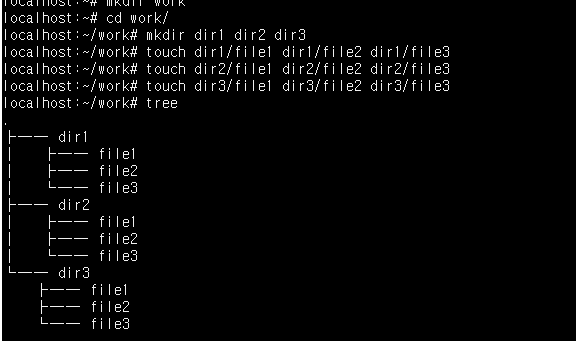
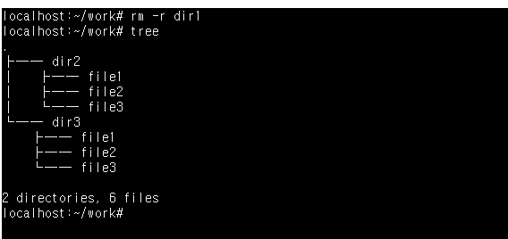
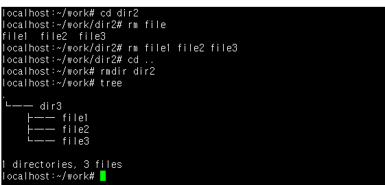
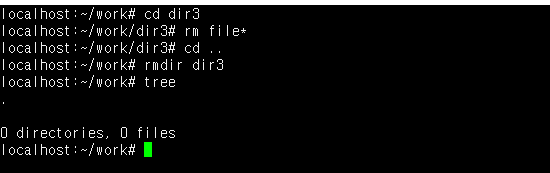

# 실습과제 1
## 예제에서 작성한 work 디렉터리 안에 다음과 같이 디렉터리 dir1, dir2, dir3를 만들고 각각 디렉터리 안에 다음과 같이 빈파일을 작성하시오. 실행과정을 모두 캡쳐하여 첨부할 것
## tree 명령어를 이용하면 파일목록을 트리구조로 출력해줌
| 실습과제 1 |
|--- |
|  |

# 실습과제 2
## 하나의 명령어로 dir1 디렉터리를 모두 지우시오.
## 작업 디렉터리를 dir2로 변경후 dir2 디렉터리 안의 모든 파일을 먼저 지우고 다시 작업 디렉터리를 부모 디렉터리로 변경 후 dir2 디렉터리를 삭제하시오.
## 작업 디렉터리를 dir3로 변경후 dir3 디렉터리 안의 모든 파일을 경로확장 기능을 이용하여 먼저 지우고 다시 작업 디렉터리를 부모 디렉터리로 변경 후 dir3 디렉터리를 삭제하시오.

| 실습과제 2 | img |
| --- | --- |
| dir1 |  |
| dir2 |  |
| dir3 |  |

# 실습과제 3
## 파일 내용을 출력하는 명령어로 cat, less, more 명령어의 차이를 설명하라.
| 명령어 | 특징 |
| --- | --- |
| cat | 파일 내용을 스크롤 없이 한꺼번에 전부 출력. 짧은 파일이나 여러 파일을 이어붙여 출력(concatenate)할 때 적합. 긴 파일은 화면이 그냥 주르륵 지나가버려 읽기 불편함. 인자 없이 실행하면 키보드 입력을 그대로 출력(Ctrl+D로 종료) |
| less | 	파일을 화면 단위로 나눠서 보여주고, Space/b로 위아래 스크롤, /문자열로 검색, q로 종료 가능. 파일 전체를 미리 읽어들이지 않아 큰 파일도 빠르게 열 수 있고, 위/아래 양방향 이동이 자유로움. 현재 리눅스에서 가장 많이 쓰이는 페이저(pager) |
| more | less와 비슷하게 화면 단위로 출력해주는 초기 형태의 페이저지만, 기본적으로 아래쪽(다음 페이지)으로만 이동 가능하고 위로 스크롤하는 기능이 제한적임(일부 구현에서만 가능). 기능이 less보다 단순하고 오래된 명령어라, 대부분 less로 대체되어 사용됨 |
