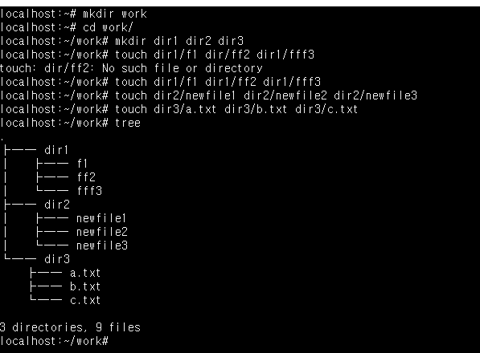
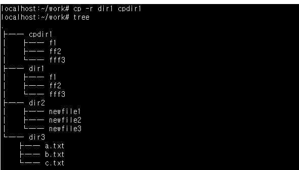
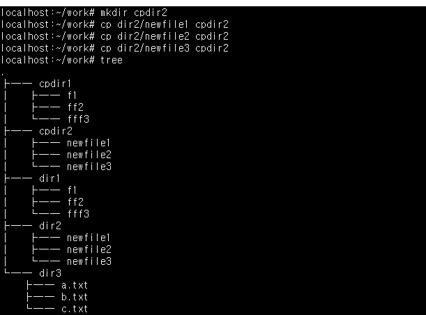
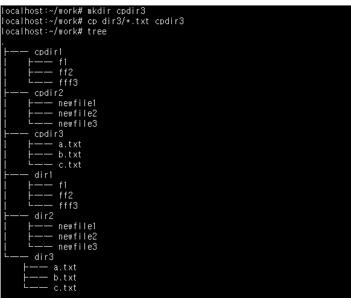
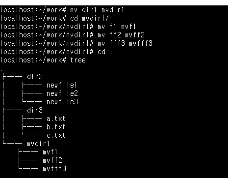
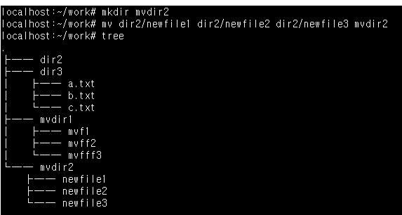
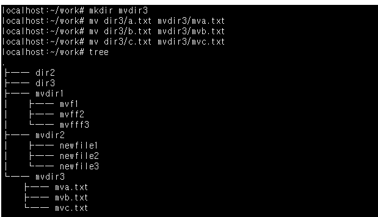
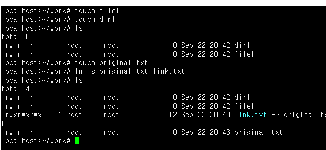

# 실습과제 1
## 사용자 홈디렉터리 안에 work 디렉터리를 만들고 다음과 같이 서브 디렉터리 dir1, dir2, dir3를 만들고 각각 디렉터리 안에 다음과 같이 빈파일을 작성하시오.
## tree 명령어를 이용하면 파일목록을 트리구조로 출력해줌
| 명령어 | 설명 |
| --- | --- |
| img |  |
| mkdir | 디렉터리 생성 |
| cd | 현재 디렉터리 이동 |
| touch | 빈 파일 생성 |

# 실습과제 2
## 하나의 명령어를 이용하여 실습과제1에서 만든 dir1 디렉터리의 파일을 아래처럼 cpdir1 디렉터리로 복사하시오.
## cpdir2 디렉터리를 먼저 만들고 실습과제1에서 만든 dir2 디렉터리의 파일을 파일단위로 1개씩 복사하시오.
## cpdir3 디렉터리를 먼저 만들고 실습과제1에서 만든 dir3 디렉터리의 파일을 경로확장 기능을 사용하여 하나의 명령어로 복사하시오.
| 명령어 | 설명 |
| --- | --- |
| img1 |  |
| cp | 파일 복사 |
| img2 |  |
| mkdir | 디렉터리 생성 |
| cp | 파일 복사 |
| img3 |  |
| mkdir | 디렉터리 생성 |
| cp | 파일 복사 |
| *.txt | *로 시작하는 txt파일들 지칭 |

# 실습과제 3
## 실습과제 1에서 만든 dir1 디렉터리와 안에 있는 파일명을 그림처럼 변경하시오.
## mvdir2 디렉터리를 생성하고 실습과제 1에서 만든 dir2 디렉터리 안에 있는 모든 파일을 그림처럼 이동하시오. dir2는 비어 있어야함
## mvdir3 디렉터리를 생성하고 실습과제 1에서 만든 dir3 디렉터리 안에 있는 모든 파일을 그림처럼 이동하고 파일명도 변경하시오. dir3는 비어 있어야함
| 명령어 | 설명 |
| --- | --- |
| img |  |
| mv | 디렉터리 또는 파일 이름 변경 |
| img |  |
| mkdir | 디렉터리 생성 |
| mv | 생성된 디렉터리로 파일 이동 |
| img |  |
| mkdir | 디렉터리 생성 |
| mv | 생성된 디렉터리로 디렉터리 및 파일명 변경 |

# 실습과제 4
## 하드링크와 심볼릭 링크의 차이를 설명하라.
## 심볼릭 링크를 확인하는 명령어를 설명하라
## 실제로 심볼릭 링크를 만들고 확인한 결과를 첨부하라.
## 빈파일과 빈디렉토리를 만든 후 파일속성(ls -l)을 출력하면 아래처럼 디렉터리는 하드링크의 수가 2이고 파일은 1이다. 이유를 설명하라.
| 구분 | 하드링크 | 심볼릭 링크 |
| --- | --- | --- |
| 본질 | 같은 실제 데이터를 가리키는 또 다른 이름 | 원본 파일의 경로를 담고있는 별도의 작은 특수 파일 |
| 원본 구분 | 원본과 링크가 구분되지 않음 | 원본과 링크가 명확히 구분됨 |
| 원본 삭제 | 다른 하드링크 이름으로 여전히 파일 데이터에 접근 가능 | 원본이 삭제되면 링크가 깨짐 |
| 디렉터리 링크 | 불가능 | 가능 |
| 생성 명령 | ln 원본 링크이름 | ln -s 원본 링크이름 |

| 명령어 | 설명 |
| --- | --- |
| img |  |
| touch | 빈 파일 생성 |
| ls -l | 파일과 디렉터리 속성 출력 |
| ln -s | 심볼릭 링크 생성 |
